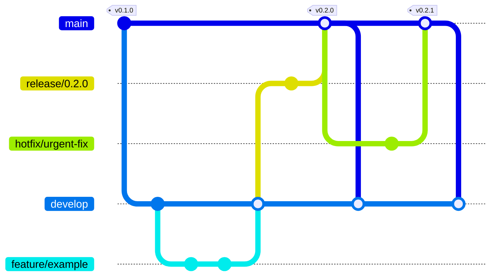
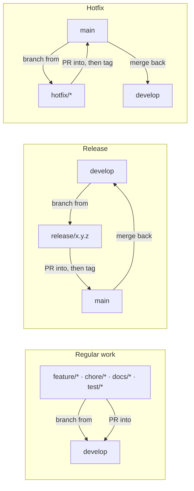

# Contributing

This repository follows [Git Flow](https://nvie.com/posts/a-successful-git-branching-model/).

## Branch model at a glance



- `main` only ever receives merges from `release/*` or `hotfix/*`, each tagged.
- `develop` receives merges from `feature/*`, `chore/*`, `docs/*`, `test/*` branches, and is synced back from `main` after every release or hotfix.
- Both `main` and `develop` are branch-protected: no direct pushes, no force-push, no deletion — all changes go through a PR.

The same flow, as a base-branch summary per workflow:



## Branches

- `main` — always releasable. Every commit on `main` corresponds to a tagged
  version (`vX.Y.Z`). Never commit to `main` directly.
- `develop` — integration branch for the next release. This is the default
  branch and the base for new work.
- `feature/<name>` — new functionality or content (e.g. new reference docs,
  new scenarios, SKILL.md changes). Branch from `develop`, PR back into
  `develop`.
- `release/<version>` — release stabilization. Branch from `develop` when
  `develop` is ready to ship. Only bug fixes, version bumps, and CHANGELOG
  updates belong here — no new features. PR into `main` (tag the merge) and
  also merge back into `develop`.
- `hotfix/<name>` — urgent fix against a released version. Branch from
  `main`, PR into `main` (tag the merge) and also merge back into `develop`.
- `chore/<name>`, `docs/<name>`, `test/<name>` — non-feature work (tooling,
  docs-only changes, test runs). Same flow as `feature/*`: branch from
  `develop`, PR back into `develop`.

## Workflow


### Regular work (features, fixes, docs, tests, chores)

```bash
git checkout develop
git pull origin develop
git checkout -b feature/short-description
# ... work, commit ...
git push -u origin feature/short-description
gh pr create --base develop --head feature/short-description
```

Merged branches are auto-deleted on GitHub. Delete your local branch too:

```bash
git checkout develop && git pull origin develop
git branch -d feature/short-description
```

### Cutting a release

```bash
git checkout develop
git pull origin develop
git checkout -b release/X.Y.Z
# bump version references, finalize CHANGELOG.md
git push -u origin release/X.Y.Z
gh pr create --base main --head release/X.Y.Z --title "release: vX.Y.Z"
# after merge:
git checkout main && git pull origin main
git tag -a vX.Y.Z -m "vX.Y.Z"
git push origin vX.Y.Z
# merge the release changes back into develop
git checkout develop && git pull origin develop
git merge main --no-edit
git push origin develop
```

### Hotfixing a released version

```bash
git checkout main
git pull origin main
git checkout -b hotfix/short-description
# ... fix, commit ...
git push -u origin hotfix/short-description
gh pr create --base main --head hotfix/short-description
# after merge, tag main (e.g. vX.Y.Z+1), then sync back into develop as above
```

## Commit messages

Use [Conventional Commits](https://www.conventionalcommits.org/) style
(`feat:`, `fix:`, `chore:`, `docs:`, `test:`, `release:`).

## Skill content changes

Changes to `SKILL.md` are the highest-leverage changes in this repo — they
alter agent behavior directly. For any non-trivial change to `SKILL.md`:

- Run (or re-run) the relevant scenarios in `tests/scenarios.md` with-skill
  vs. baseline, and record the result under `tests/results/`.
- Note in the PR description whether the change is expected to affect any
  existing behavioral test result.
